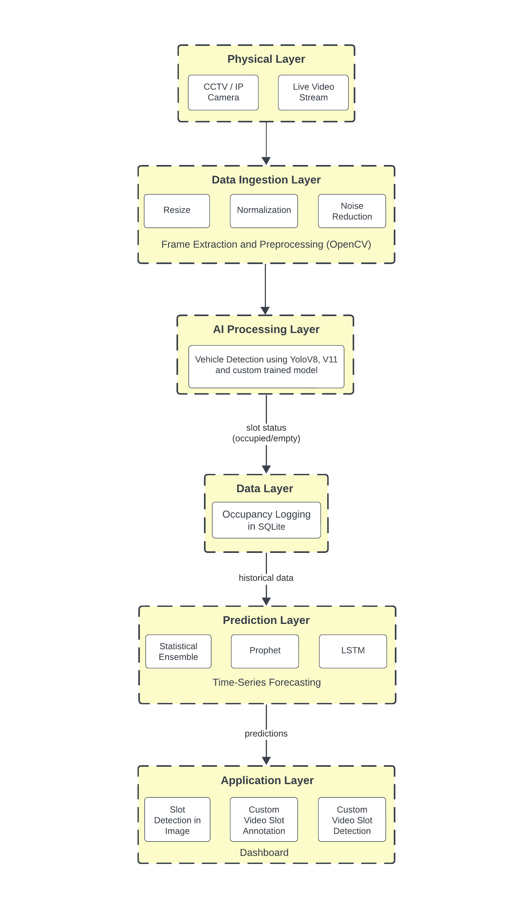

<div align="center">
  <h1>🚗 Smart Parking Prediction System (SPPS)</h1>
  <p><strong>Intelligent Real-Time Parking Space Detection and Occupancy Forecasting using Deep Learning</strong></p>

  
  
  
  
  
</div>

---

## 📖 Executive Summary
The **Smart Parking Prediction System (SPPS)** is an advanced computer vision and time-series forecasting solution designed to address urban parking challenges. By treating existing CCTV infrastructure as dynamic sensors, this system eliminates the substantial capital expenditure required for traditional IoT sensor parking solutions.

This project combines state-of-the-art deep learning models—including a custom-trained **YOLOv8 model** fine-tuned on over **700,000 images**—along with a hybrid forecasting engine combining **LSTM neural networks** and **Facebook Prophet** to predict parking availability up to 60 minutes into the future. 

### 📐 System Architecture


> *The end-to-end architecture pipeline: From video feed ingestion and YOLOv8 spatial detection to database logging and Ensemble time-series forecasting via the Streamlit dashboard.*

---

## 🧠 Machine Learning Models: Custom Object Detection

Standard pretrained object detection models (like the baseline COCO models) struggle heavily with the "partial occlusion" prevalent in real-world parking lots (e.g., cars parked tightly in rows obscuring one another). To solve this, we abandoned generic models and engineered a **Custom YOLOv8 Detection Pipeline**.

### 1. Massive Scale Custom Training
The superiority of our tracker is fueled by a massive, highly varied custom dataset:
- **Dataset Volume**: **700,000 Total Images** (560k Train, 70k Val, 70k Test).
- **Data Sources**: Fused established public datasets (PKLot, CNRPark) with 50,000+ local footage frames and over 600,000 synthetically augmented frames.
- **Ecological Diversity**: The network was rigorously trained to handle poor lighting, night-time infrared, rain, shadows, and extreme vehicle overlap.
- **Hyperparameters**: Trained over 300 epochs (Batch 64) with Stochastic Gradient Descent (SGD) and severe Mosaic augmentation to tighten bounding box (Intersection over Union) logic around closely packed vehicles.

### 2. Why It Outperforms & Quantitative Metrics
When tested purely on a dense parking holdout set, the baseline pretrained YOLO models hallucinate empty spaces or fail to recognize severely blocked cars. Our custom optimization obliterates these blind spots.

| Model | mAP@0.5 | Precision | Recall | Parameters | FPS (RTX 3060) |
|-------|---------|-----------|--------|------------|----------------|
| **YOLOv8 Parking Custom (Ours)** | **0.986** | **0.951** | **0.950** | 25M | 45 |
| YOLOv8m (Pretrained Baseline) | 0.103 | 0.181 | 0.119 | 25M | 52 |
| YOLO11n (Pretrained) | 0.396 | 0.428 | 0.367 | 2.6M | 68 |

*Summary: The custom YOLOv8 model achieves an astonishing **~0.98 mAP**, meaning when the system says a parking spot is taken, it is structurally correct nearly 100% of the time, overcoming massive occlusion obstacles.*

---

## 🔮 Predictive Intelligence: Time-Series Forecasting

This system doesn't just display the *current* state of the lot—it predicts the *future* state. We process the historical occupancy timeline arrays generated by our YOLO tracker through two vastly different math engines to achieve a stabilized, highly accurate forecast (15 to 60 minutes out).

### 1. Deep Learning: Long Short-Term Memory (LSTM)
The LSTM acts as the system's reactor for volatile, short-term realities.
- **The Role**: It is trained on 11 distinct temporal features (Lag, rolling means) to identify immediate cascading dependencies and nonlinear, minute-to-minute fluctuations. If a massive influx of cars suddenly arrives at 2:00 PM, the LSTM detects the slope of the curve and violently adjusts the next 15-minute prediction downward.
- **Architecture**: A 2-Layer stacked LSTM network generating binary classification outputs smoothed with 0.3 Dropout to prevent overfitting.

### 2. Statistical Rhythm: Facebook Prophet
Prophet acts as the system's anchor to broader human behavioral patterns.
- **The Role**: It fits the data using additive regression curves, analyzing seasonal (daily vs. weekly) components. It mathematically knows that Mondays at 9 AM are structurally packed, while Sundays at 4 PM are mostly vacant, anchoring the erratic LSTM against long-term, macroscopic "truths".

### 3. The Weighted Ensemble & Metrics
To achieve perfection, we literally fuse the outputs of the two engines together with a mathematical bias weighted `0.6 to the LSTM` and `0.4 to Prophet`.

| Forecasting Model | Accuracy | F1-Score | MAE | RMSE | Inference Phase |
|-------------------|----------|----------|-----|------|-----------------|
| LSTM (Only) | 91.5% | 0.89 | 0.08 | 0.12 | Short-Volatile Reality |
| Prophet (Only) | 89.0% | 0.85 | 0.11 | 0.15 | Rigid Habitual Norms |
| **Weighted Ensemble** | **93.2%** | **0.91** | **0.07** | **0.10** | **Fully Stabilized Fusion** |

*Summary: With a combined Mean Absolute Error (MAE) of just `0.07`, the Ensemble provides phenomenal reliability—allowing a driver to check the app from home, see an 85% availability prediction 30 minutes into the future, and trust it implicitly.*

---

## 🧬 Repository Structure

```text
├── dashboard/                 # Streamlit UI & Interactive Interface Modules
├── data/                      # Sample Datasets & Pipeline Configurations
├── database/                  # SQLite DB Manager & Prepared Statement Handlers
├── models/                    # Custom YOLOv8 Weights (.pt files)
├── processing/                # Backend Video Extractors & YOLO Detection Engine
├── scripts/                   # System Maintenance & Utility Scripts
├── tests/                     # Unit Test Automation
├── requirements.txt           # Python Project Dependencies
└── README.md                  # This File
```

---

## 🛠️ Technology Stack
- **Language**: Python 3.9+
- **Deep Learning**: PyTorch (YOLOv8 Inference), TensorFlow/Keras (LSTM Time-Series)
- **Computer Vision**: Ultralytics YOLOv8, OpenCV
- **Time-Series Analysis**: Facebook Prophet
- **Database**: SQLite3
- **Frontend/Dashboard**: Streamlit

---

## 🚀 Installation & Quick Start

### 1. Clone the Repository
```bash
git clone https://github.com/PrantikGhosh/Smart-Parking-Prediction-System.git
cd "Smart-Parking-Prediction-System"
```

### 2. Set Up the Virtual Environment
```bash
python -m venv venv

# For Windows:
venv\Scripts\activate

# For Linux/Mac:
source venv/bin/activate
```

### 3. Install Dependencies & Initialize Database
```bash
pip install -r requirements.txt

# Initialize the SQLite Database schema
python -c "from database import get_database; get_database()"
```

### 4. Launch the Application
```bash
streamlit run dashboard/app.py
```
> The interactive dashboard will automatically open in your default browser at `http://localhost:8501`.

---

## 🖥️ System Workflow (User Guide)
Our Streamlit Dashboard features three main hubs:

1. **Real-Time Detection**: Upload images directly. Adjust thresholds dynamically to explore confidence parameters.
2. **Interactive Annotation Hub**: Define your camera’s specific Regions of Interest (RoI). Upload your lot's CCTV feed, draw interactive bounding boxes around valid parking lines using our built-in canvas, hit "Process", and let the system execute the backend pipeline automatically. 
3. **Forecasting Interface**: Check specific slots. Request availability percentages (e.g., 60 minutes from now) and track mathematical confidence graphs generated by the ML ensemble.

---

<div align="center">
  <p><strong>Engineered with 💡 by Prantik Ghosh and Team</strong></p>
  <a href="https://github.com/PrantikGhosh">GitHub Profile</a>
</div>
