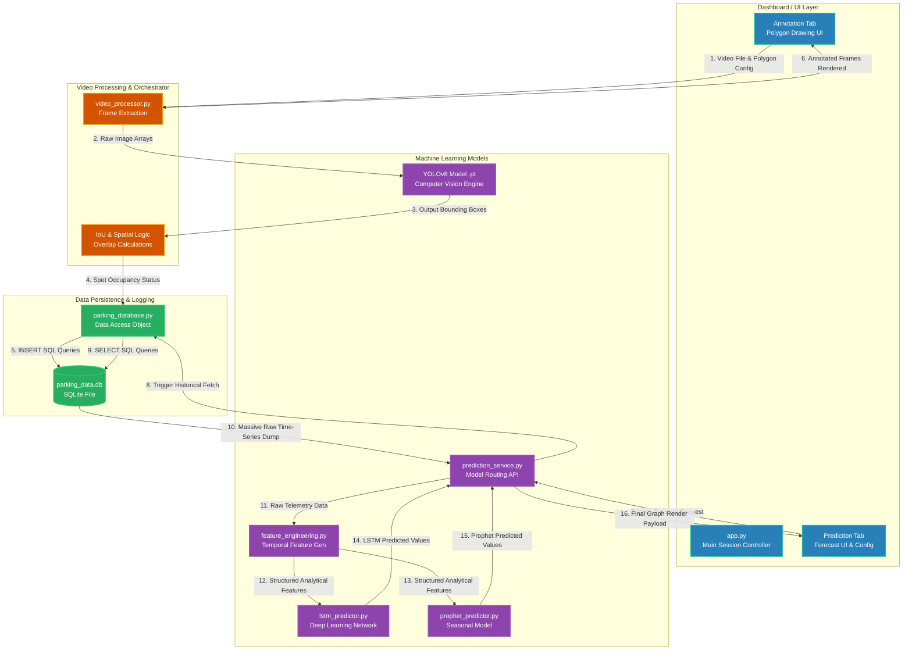

# Comprehensive Project Architecture and Execution Flow

This document provides an in-depth, technical breakdown of every directory, file, and data pipeline within the Smart Parking Prediction System. It is designed to aid developers, researchers, and maintainers in understanding the modular architecture, the rationale behind each component, and how the entire system cohesively predicts parking availability using computer vision and time-series forecasting.

---

## 📂 1. Directory Structure Overview

The repository is purposefully structured to cleanly separate concerns. The frontend UI, the backend databases, the machine learning models, and the data processing utilities are all decoupled so they can be modified independently.

```text
📦 Final Year Project TimeSeriesPrediction
 ┣ 📂 .streamlit/            # Environment configurations for the Streamlit dashboard
 ┣ 📂 dashboard/             # Frontend user interface modular components and pages
 ┣ 📂 data/                  # Raw and processed datasets, labels, and cache
 ┣ 📂 database/              # SQLite database structure and management scripts
 ┣ 📂 models/                # Machine learning models (YOLO, LSTM, Prophet)
 ┣ 📂 processing/            # Data orchestration and video processing utilities
 ┣ 📂 research_archive/      # Historical scripts, notebooks, and earlier experiments
 ┣ 📂 runs/                  # Output directory for YOLOv8 training/validation runs
 ┣ 📂 scripts/               # Utility scripts for data manipulation and training
 ┣ 📂 tests/                 # Unit and integration test files
 ┣ 📂 videos/                # Input video files for parking lot monitoring
 ┣ 📜 FINAL_README.md        # Generalized project overview and setup instructions
 ┣ 📜 MODEL_COMPARISON.md    # Detailed performance comparison of the ML models
 ┣ 📜 RESEARCH_README.md     # In-depth technical documentation for research paper
 ┣ 📜 PROJECT_STRUCTURE.md   # This file; a detailed map of the project architecture
 ┣ 📜 requirements.txt       # Python dependencies required to run the project
 ┗ 📜 benchmark_results.csv  # Logged results from model performance benchmarking
```

---

## 🔍 2. Deep Dive: Component Breakdown

### 🖥️ 2.1 `dashboard/` (The User Interface)
The `dashboard/` directory contains all the elements required to render the interactive Streamlit application. It is the sole graphical entry point for users interacting with the system.

*   **Why it is necessary:** Separating the UI from the backend logic follows a clean MVC (Model-View-Controller) design pattern. It allows the heavy ML models and complex video sub-processes to be developed, refactored, and tested completely independently of the frontend application.
*   **`app.py`**: The central controller script for the frontend. It manages the global session state, controls sidebar navigation, and dynamically loads the required modules based on whether the user is setting up the video feed or looking at predictions.
*   **`components/`**: A subdirectory storing reusable, isolated UI widgets. For example, metric cards showing "Total Spots," styled buttons, and custom CSS integrations. This avoids code duplication across different Streamlit pages.
*   **`tab_annotation_interactive.py` & `tab_annotation_simple.py`**: These scripts manage the UI for the setup phase. They contain the logic that allows users to interactively draw polygons on a static video frame using their mouse to define where individual parking spots are located on the screen.
*   **`tab_predictions_simple.py`**: The primary interface for the forecasting module. It provides interactive controls for selecting a mathematical model (LSTM, Prophet, Statistical estimators), defining a prediction timeframe (e.g., next 24 hours), and rendering the interactive Plotly charts showing the forecasted parking lot occupancy.

### 🧠 2.2 `models/` (The Machine Learning Engine)
This directory is the core intellectual property of the project, housing both the object detection layers and time-series forecasting algorithms.

*   **Why it is necessary:** Centralizing all AI/ML logic means any updates to model weights, Python hyperparameters, or the introduction of new models (like XGBoost) only require localized changes within this specific folder, isolated from the rest of the application.
*   **`yolov8_parking_custom.pt` & `yolov8_parking_optimized.pt`**: These are serialized PyTorch weight files for the YOLOv8 object detection model. They have been specifically fine-tuned and trained on parking lot datasets to accurately detect vehicles from various challenging camera angles and diverse lighting conditions.
*   **`yolo11n.pt` & `yolov8m.pt`**: Standard, pre-trained Ultralytics YOLO models (nano and medium size). They are kept here to serve as baseline benchmarks against the custom-trained models.
*   **`prediction_service.py`**: Acts as an API (Façade pattern) wrapper. When the dashboard requests a prediction, it calls this service rather than the ML models directly. This service acts as a router, distributing the data to the correct predictor class.
*   **`feature_engineering.py`**: Crucial for effective time-series forecasting. It takes raw database timestamps (e.g., `2023-10-14 08:30:00`) and transforms them into usable numerical features for the neural networks (e.g., `hour_of_day=8`, `is_weekend=False`, `rolling_mean_last_3_hours=42`).
*   **`lstm_predictor.py`**: Contains the Keras/TensorFlow architecture for the Long Short-Term Memory (LSTM) neural network. It encapsulates methods for min-max data scaling, temporal sequence generation (lookback sliding windows), model training, and future step predicting.
*   **`prophet_predictor.py`**: A dedicated wrapper for the Facebook Prophet time-series model. It is configured and optimized specifically for handling and understanding daily and weekly seasonal cycles inherent in parking data.
*   **`statistical_models.py`**: Contains simpler baseline algorithms (like Moving Averages or ARIMA) to demonstrate the improved accuracy and baseline comparisons explicitly provided by the more complex LSTM/Prophet models.
*   **`ensemble_predictor.py`**: Advanced logic that extracts predictions from *both* the LSTM and Prophet models, and intelligently averages them to produce a highly stable, robust single forecast.

### 🗄️ 2.3 `database/` (Data Persistence Layer)
This directory manages the storage, structuring, and retrieval of real-time occupancy data generated by the YOLO model telemetry.

*   **Why it is necessary:** Deep time-series models (like LSTM or Prophet) require extensive historical context to learn trends and predict the future accurately. The database acts as the long-term memory of the system, permanently logging how many cars were parked at any given minute of any given day.
*   **`parking_data.db`**: The physical SQLite database file. SQLite was chosen for its lightweight, serverless nature, making the application highly portable since there are no external database services to install.
*   **`schema.sql`**: The fundamental blueprint of the database. It contains SQL logic that defines tables such as `OccupancyLog` (recording the exact timestamp, spot_id, and status) and `CameraFeeds` (for saving video metadata).
*   **`parking_database.py`**: A Python DAO (Data Access Object) script. Instead of writing raw SQL strings directly inside the Streamlit UI or the video processor, those modules simply call safe Python functions in this script (e.g., `insert_occupancy_record()`, `get_historical_data(start_date, end_date)`).

### ⚙️ 2.4 `processing/` (The System Orchestrator)
This critical directory acts as the middle layer bridging the gap between raw video inputs, the YOLO models detecting objects, and the database recording the results.

*   **Why it is necessary:** The YOLO AI only detects vehicles (outputting boxes). It does *not* know what a parking spot is. The processing module adds the spatial logic to determine if a detected vehicle bounding box is physically situated inside a defined parking spot polygon on the screen.
*   **`video_processor.py`**: The workhorse script of the real-time system. It opens a video stream using OpenCV, feeds subsequent frames to YOLOv8, extracts vehicle bounding boxes, and crucially calculates the Intersection over Union (IoU) with the user-defined spots. It determines occupancy status, draws the bounding boxes and text overlays onto the frame, logs the data to the database, and loops indefinitely.

### 🛠️ 2.5 `scripts/` (Development Utilities & Tooling)
A standalone collection of Python scripts used primarily during the development, benchmarking, and machine learning data preparation phases.

*   **Why it is necessary:** Preparing enormous datasets for custom YOLO training and converting between standard formats (like COCO JSON to YOLO TXT format) is incredibly complex and error-prone. These scripts automate those data engineering workflows.
*   **`train_yolo.py`**: A configuration script that sets vital hyperparameters (epochs, learning rate, batch size) and initiates the Ultralytics YOLOv8 training process on the custom `.yaml` dataset.
*   **`coco_to_yolo.py` & `restructure_dataset.py`**: Vital scripts that read standard COCO-formatted JSON annotations and syntactically convert them into the highly specialized flat directory structure and `.txt` bounding box format exactly as required by YOLO.
*   **`check_label_format.py` & `check_label_match.py`**: QA (Quality Assurance) scripts. They rapidly scan the entire dataset folder to ensure every single image has a perfectly corresponding label file, and that the bounding box coordinates are correctly normalized between `0.0` and `1.0`.
*   **`benchmark_models.py`**: Automates the tedious task of testing YOLO, LSTM, and Prophet across a reserved validation dataset, generating the metrics logged inside the `benchmark_results.csv` file.

### 📂 2.6 Storage & History Directories (`data/`, `runs/`, `videos/`, `research_archive/`)
*   **`data/`**: The staging ground for datasets. It contains the large image folders and label text files actively used during model training.
*   **`runs/`**: An auto-generated output directory actively maintained by Ultralytics YOLO. It contains the extensive output metrics from training runs, including precision-recall graphs, F1-confidence curves, confusion matrices, and the resultant `.pt` weight check-points.
*   **`videos/`**: The standard input directory where MP4 or AVI source files of parking lots are permanently placed for the app to process.
*   **`research_archive/`**: Contains unstructured Jupyter Notebooks (`.ipynb`) and experimental scripts that were used to test initial hypotheses before they were formalized into the clean codebase.

---

## 🔄 3. Comprehensive Data & Execution Flow

To fully grasp the architecture, it is essential to understand the data lifecycles. The system operates in two completely distinct, sequential phases. The database outputs of Phase 1 are strictly required as the inputs for Phase 2.

### 📹 Phase 1: Real-Time Detection & Telemetry Logging
This phase is responsible for continuously monitoring the parking lot via video and generating structured historical data about vehicle occupancy.

1.  **Initialization**: 
    *   The user starts the application backend (`streamlit run dashboard/app.py`).
    *   They navigate to the interactive annotation tab, upload a target video from `videos/`, and literally draw polygons representing individual parking spaces onto the UI. This spatial configuration is saved in memory.
2.  **Stream Processing Trigger**: 
    *   The frontend UI signals `processing/video_processor.py` to begin stream consumption.
    *   The processor extracts the continuous frames using the `cv2.VideoCapture` library.
3.  **Inference Allocation**: 
    *   The frame is actively passed to the loaded YOLOv8 model (`models/yolov8_parking_optimized.pt`).
    *   YOLO processes the image tensors and returns a numeric list of bounding boxes (Coordinates: `x_center, y_center, width, height`) for all detected vehicles in that single frame.
4.  **Spatial Analysis**: 
    *   For each user-defined parking spot polygon, `video_processor.py` executes a mathematical calculation for the overlap (IoU) with every vehicle bounding box.
    *   If the overlap exceeds a strict, configurable threshold, the parking spot is marked **Occupied (Red)**; otherwise, it is designated **Available (Green)**.
5.  **Data Persistence**: 
    *   The boolean status of every spot, alongside the exact current system timestamp, is bundled into a payload and sent to the data access object at `database/parking_database.py`.
    *   The payload is executed securely as an SQL `INSERT` statement into `parking_data.db`.
6.  **Visual Feedback Loop**: 
    *   The processor dynamically draws the bounding boxes, polygons, and text overlays back onto the raw visual frame matrix.
    *   The fully annotated frame is streamed back to the stream component on the Streamlit frontend for the user to view in real-time. This repeats at roughly 30 frames per second.

### 📈 Phase 2: Time-Series Forecasting
This phase entirely ignores the video and YOLO models. It strictly models and predicts the future using the historical telemetry database generated by Phase 1.

1.  **User Request**: 
    *   The user navigates to the Streamlit predictions tab, selects their desired algorithm (e.g., "LSTM"), and requests a forecast length for the next 12 hours.
2.  **Data Extraction**: 
    *   The `dashboard` asynchronously calls the `models/prediction_service.py` API.
    *   The service queries `database/parking_database.py` for all logs up to the present moment. It returns a massive raw DataFrame of sequential timestamps and occupancy integers.
3.  **Data Transformation (Crucial Step)**: 
    *   The raw DataFrame is immediately passed to `models/feature_engineering.py`.
    *   The data is resampled (e.g., grouped from secondly data into 15-minute averaged intervals) to reduce immense temporal noise.
    *   Time-based cyclical features (Hour, Day, Month) and lagged historical features (e.g., "What was the occupancy exactly 24 hours ago?") are generated and appended as columns.
4.  **Model Execution**: 
    *   The now structured feature set is passed to the core logic in `models/lstm_predictor.py` (or `prophet_predictor.py`).
    *   The LSTM model generates a structured sequence of forecasted values spanning the requested 12 hours based on the learned, non-linear cyclical patterns of previous days.
5.  **Graph Rendering**: 
    *   The forecasted array sequence is returned to the dashboard.
    *   Streamlit parses the numbers into an incredibly interactive Plotly graph component, overlaying the historical actual data points seamlessly with the predicted future array, complete with statistical confidence intervals.

---

## 🏛️ 4. Detailed System Architecture Diagram

This flowchart illustrates the technical boundaries, sub-systems, and the exact flow of data states through the system's components visually.




## 🔬 5. Deep Dive into Core Scripts

To genuinely understand the engine driving this system, one must look closely at three specific Python scripts. These scripts perform the heavy lifting for real-time video processing, mathematical data transformation, and deep learning prediction.

### 🎥 5.1 `processing/video_processor.py` (The Spatial Logic Engine)

While YOLOv8 is powerful, it is only abstractly aware of "vehicles" as mathematical bounding boxes `[x1, y1, x2, y2]`. It has zero concept of what a "parking spot" is. The `video_processor.py` script acts as the vital logic bridge between raw AI object detection and actionable real-world occupancy data.

**Key Technical Responsibilities:**
1.  **Frame Extraction & Tensor Conversion**: Subscribes to the OpenCV `VideoCapture` object. It pulls out a raw BGR numpy array frame by frame and pushes it directly into the YOLOv8 PyTorch model for GPU inference.
2.  **Point-in-Polygon (Ray Casting) & IoU Math**: This is the script's core algorithm:
    *   It takes the coordinates of every user-drawn polygon (the parking spots).
    *   It takes the center point coordinates of every YOLO-detected vehicle bounding box.
    *   It calculates whether a vehicle's center point falls mathematically inside the polygon boundaries using point-in-polygon algorithms.
    *   For higher accuracy, it also calculates the **Intersection over Union (IoU)**—the percentage of the vehicle's bounding box area that overlaps with the parking spot polygon area. If the overlap is > `0.45` (configurable), the algorithm confirms a vehicle is parked there, avoiding false positives like cars just driving past the spot.
3.  **State Management**: It avoids spamming the database. The script maintains an internal dictionary of the *previous* frame's occupancy state. It only triggers an SQL `INSERT` to the `parking_database.py` when a parking spot's status *changes* (e.g., from Free -> Occupied), significantly reducing the SQLite write load.
4.  **Visual Overlay Processing**: Uses `cv2.fillPoly`, `cv2.rectangle`, and `cv2.putText` to draw the red/green parking spot highlights and vehicle bounding boxes onto the frame array before tossing the annotated frame back to the UI to be displayed.

### 🧮 5.2 `models/feature_engineering.py` (The Time-Machine Transformer)

Machine learning models like LSTMs cannot understand raw dates like `"2023-11-04 14:32"`. They only understand normalized floating-point numbers. This script transforms flat, chronological database logs into a rich, multi-dimensional matrix of predictive features.

**Key Technical Responsibilities:**
1.  **Temporal Aggregation (Resampling)**: The database records data down to the second. This is too noisy for long-term forecasting. This script uses Pandas (`df.resample('15T').mean()`) to average the data into clean 15-minute or 1-hour blocks, creating a stable time-series curve.
2.  **Cyclical Feature Extraction**: Human behavior drives parking (e.g., busy at 9 AM, empty at 3 AM). This script mathematically exposes these human cycles to the ML model by extracting integer attributes from the timestamp:
    *   `hour_of_day` (0-23)
    *   `day_of_week` (0-6)
    *   `is_weekend` (Boolean 0 or 1)
3.  **Lagged Features (Autocorrelation)**: The best predictor of the future is the recent past. The script generates "Lag" columns. For example, if predicting the occupancy at 10:00 AM today, a crucial input metric is the exact occupancy at 10:00 AM *yesterday* (`lag_24h`), or exactly 1 week ago (`lag_168h`).
4.  **Rolling Statistics**: Calculates the smoothing trends leading up to the prediction moment. It generates columns like `rolling_mean_3h` or `rolling_std_dev_6h`, helping the model understand if the parking lot is currently filling up rapidly or emptying slowly over the last few hours.

### 🧠 5.3 `models/lstm_predictor.py` (The Deep Learning Recurrent Network)

While Prophet handles the broad daily/weekly seasonal curves, the LSTM (Long Short-Term Memory) neural network aims to learn complex, non-linear sequences and micro-patterns in the parking behavior that simpler statistical models would miss.

**Key Technical Responsibilities:**
1.  **Min-Max Normalization**: Neural networks require data standardized between `0.0` and `1.0` to ensure stable gradient descent during backpropagation. This script applies `sklearn.preprocessing.MinMaxScaler` to all occupancy integers and engineered features before training, and inversely transforms the final predicted floats back into human-readable car counts.
2.  **Sliding Window Sequence Generation**: LSTMs do not look at single rows of data; they look at *sequences* of time. This script algorithmically slices the continuous historical Pandas DataFrame into overlapping 3D numpy matrices: `[Samples, Time Steps (e.g., last 24 hours), Features]`. This is the exact format required by Keras/TensorFlow recurrent layers.
3.  **Keras Topology Definition**: Defines the specific stacked architecture of the neural network:
    *   An `Input` layer taking the 3D sequence.
    *   Multiple `LSTM` spatial layers (e.g., 64 units -> 32 units) to capture long-term temporal dependencies without the vanishing gradient problem.
    *   `Dropout` layers (e.g., 20% randomization) rigorously applied to prevent the model from memorizing the training data (overfitting).
    *   A final `Dense` linear output layer projecting the exact sequence of predicted numbers for the upcoming timeframe.
4.  **Autoregressive Forecasting**: When asked to forecast 12 hours into the future, the script employs an autoregressive loop. It predicts the *first* hour, appends that prediction to the end of its input array, drops the oldest hour from the start, and feeds the new synthetic array back into the network to predict the *second* hour, chaining forward iteratively.

## Conclusion

The entire repository is purposely decoupled into these granular modules. Because the computer vision sub-system (`YOLOv8`) operates entirely independently from the forecasting sub-system (`LSTM`), developers can intuitively swap out the object detection model for a newer version without needing to alter a single line of the time-series forecasting code. This strict separation of concerns, managed solely via database telemetry passing, makes the overall project remarkably robust, scalable, and easy to maintain.
